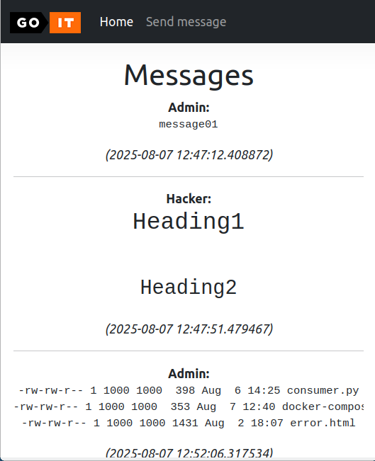

# goit-cs-hw-06

## install libraries

```
pip install websockets
pip install pymongo
pip install python-dotenv
```

## run MongoDB locally using Docker

-   https://www.mongodb.com/docs/manual/tutorial/install-mongodb-community-with-docker/
-   https://hub.docker.com/_/mongo

```
docker pull mongodb/mongodb-community-server:latest
docker run --name my-mongodb -p 27017:27017 -d mongodb/mongodb-community-server:latest
```

### run MongoDB container with volume

To run a MongoDB container named my_mongo_db and persist its data in a Docker-managed volume named mongo_data_volume, the command would be:

```
docker run -d --name my_mongo_db -p 27017:27017 -v mongo_data_volume:/data/db mongodb/mongodb-community-server:latest
```

#### Optional: Creating the volume

While Docker automatically creates the volume if it doesn't exist, you can also create it explicitly beforehand using:

```
docker volume create mongo_data_volume
```

### start MongoDB container

```
docker start my-mongodb
```

### To interact with your MongoDB instance using the mongosh shell

```
docker exec -it my-mongodb mongosh
```

### The MongoDB Server log is available through Docker's container log:

```
docker logs my-mongodb
```

## Run programm

```
git clone git@github.com:dvankevich/goit-cs-hw-06.git
cd goit-cs-hw-06.git/webmessenger
cp .env.docker .env

docker-compose up
```

programm url - http://localhost:3000

## Screenshots


send message

view messages
